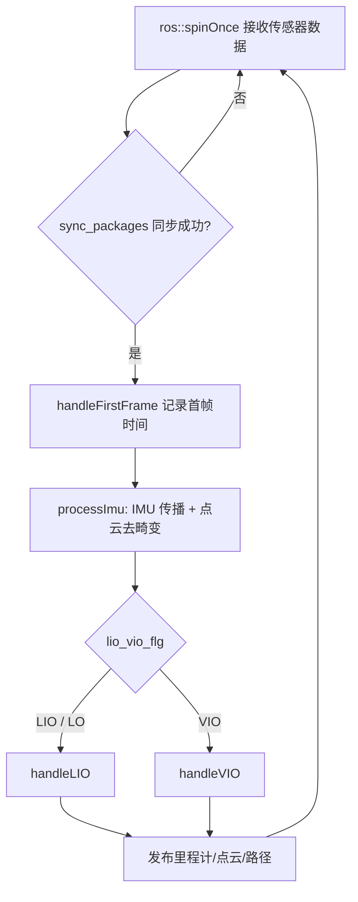

# FAST-LIVO2 系统介绍

本文档从**系统特点**、**运行流程**与**算法优劣**三方面介绍 [FAST-LIVO2](https://github.com/hku-mars/FAST-LIVO2)（*Fast, Direct LiDAR-Inertial-Visual Odometry*）。更完整的安装与数据集说明见项目根目录 [README.md](../README.md)。

---

## 1. 系统概述

FAST-LIVO2 是香港大学火星实验室（HKU MaRS）提出的**激光-惯性-视觉紧耦合里程计与建图系统**，发表于 **IEEE T-RO 2024**。相比一代 FAST-LIVO，二代在**体素平面地图**、**直接法视觉前端**与**LIVO 交替更新机制**上进一步提速，面向机载实时定位与三维重建，尤其在**纹理贫乏、光照变化或 LiDAR 退化**场景下仍能保持较高精度。

核心思想：在统一的 **误差状态卡尔曼滤波（ESKF）** 框架下，用 **LiDAR 点-面直接约束** 与 **图像块光度直接约束** 共同估计 19 维系统状态，避免传统“特征提取 + 后端优化”的多阶段流水线，从而实现高频率、低延迟的在线估计。

---

## 2. 主要特点

### 2.1 多传感器紧耦合

| 模块 | 作用 |
|------|------|
| **IMU** | 高频状态传播、点云运动畸变校正、零偏/重力/曝光时间估计 |
| **LiDAR** | 点-面匹配、体素八叉树平面地图构建与更新 |
| **Camera** | 稀疏直接法 VIO：图像块（patch）光度残差，与 LiDAR 体素地图共享几何结构 |

三种运行模式由配置 `img_en`、`lidar_en`、`imu_en` 自动决定（见 `LIVMapper::initializeComponents`）：

| 模式 | 条件 | 说明 |
|------|------|------|
| `LIVO` | 激光 + 图像均开启 | 完整 LiDAR-Inertial-Visual 融合（推荐） |
| `ONLY_LIO` | 仅激光 + IMU | 无相机时的 LiDAR-惯性里程计 |
| `ONLY_LO` | 仅激光、关闭 IMU | 纯激光里程计（退化场景下精度有限） |

### 2.2 直接法（Direct）而非特征法

- **LIO**：不对点云做角点/边缘特征提取；当前扫描点与**体素内拟合平面**建立点到面残差，通过 EKF 迭代更新位姿。
- **VIO**：在图像网格上维护稀疏 **VisualPoint** 与多尺度 **patch**，用光度误差（可选逆组合、曝光估计、法向/射线投射等）更新位姿，并从 LiDAR 体素地图中检索/补充视觉地图点。

### 2.3 体素八叉树平面地图（Voxel Plane Map）

- 世界空间划分为体素，每个体素用八叉树细分，叶子节点拟合**局部平面**（法向、中心、协方差）。
- 相比稠密点云地图，内存与匹配效率更利于**实时**运行；支持局部地图滑动（`map_sliding_en`）。

### 2.4 LIVO 交替更新

在 `LIVO` 模式下，以**相机曝光时刻**为时间锚点：先对截止该时刻的 LiDAR 扫描做 **LIO**，紧接着用同一时刻的图像做 **VIO**，形成「LIO → VIO → LIO → VIO …」的紧耦合节奏（详见第 3 节）。

### 2.5 统一状态与协方差

状态维度 `DIM_STATE = 19`，包含：

- 位姿：`rot_end`（旋转）、`pos_end`（位置）
- 运动：`vel_end`（速度）
- IMU：`bias_g`、`bias_a`、`gravity`
- 视觉：`inv_expo_time`（逆曝光时间，用于亮度变化）

LIO 与 VIO 均在该状态及其协方差上更新，保证**滤波层面**的一致融合。

### 2.6 工程与生态

- **ROS1** 节点 `fastlivo_mapping`（包名 `fast_livo`），订阅 LiDAR / IMU / 图像，发布里程计、路径、配准点云等。
- 支持多种 LiDAR 驱动格式（Livox Avia、Velodyne、Ouster、Hesai 等，见 `preprocess` 与 `config/*.yaml`）。
- 可选：PCD/Colmap 导出、evo 轨迹输出、RViz 可视化、高频率 IMU 传播里程计（`imu_rate_odom`）。
- 配套 [**FAST-Calib**](https://github.com/hku-mars/FAST-Calib) 标定、[**LIV_handhold**](https://github.com/xuankuzcr/LIV_handhold) 硬同步采集设备、[**FAST-LIVO2-Dataset**](https://connecthkuhk-my.sharepoint.com/:f:/g/personal/zhengcr_connect_hku_hk/ErdFNQtjMxZOorYKDTtK4ugBkogXfq1OfDm90GECouuIQA?e=KngY9Z) 评测数据。

---

## 3. 运行流程

### 3.1 软件启动流程（用户侧）

```text
1. 编译工作空间（catkin_make）并 source devel/setup.bash
2. 准备传感器外参/时间偏移 → 写入 config/*.yaml 与 camera_*.yaml
3. roslaunch fast_livo mapping_*.launch    # 加载对应配置
4. 播放 rosbag 或接入实时驱动（LiDAR + IMU + Camera）
5. RViz 查看 /aft_mapped_to_init、/cloud_registered、/path 等话题
```

典型 launch：`launch/mapping_avia.launch`（Livox Avia + 针孔相机）。

### 3.2 主线程算法流水线

主程序入口为 `main.cpp` → `LIVMapper::run()`，每轮循环逻辑如下：



#### （1）数据同步 `sync_packages`

- 将 LiDAR、IMU、图像写入各自缓冲区（回调函数入队）。
- **ONLY_LIO**：以一整帧 LiDAR 结束时刻为 `lio_time`，收集此前 IMU，触发一次 LIO。
- **LIVO**：
  - 当状态为 `WAIT` 或 `VIO` 后：取**下一帧图像**曝光时间 `img_capture_time`，收集 IMU，并按时间将 LiDAR 点切分为 `pcl_proc_cur`（用于本次 LIO）与 `pcl_proc_next`（留给下一周期），设置 `lio_vio_flg = LIO`。
  - 当状态为 `LIO` 后：用缓冲中的图像构造测量组，设置 `lio_vio_flg = VIO`。
- 图像时间早于上次 LIO 更新时刻时，会丢弃该帧并报错（需检查 `img_time_offset` / 硬同步）。

#### （2）IMU 处理 `processImu` → `ImuProcess::Process2`

- 根据当前 `lio_vio_flg` 选择传播终点时刻（LIO 用 `lio_time`，VIO 用 `vio_time`）。
- IMU 积分传播 `StatesGroup`，估计陀螺/加计零偏与重力；LIO 时对点云做**运动畸变校正**得到 `feats_undistort`。
- 可选 `gravity_align_en`：初始化后将重力对齐到世界系 z 轴。

#### （3）LIO `handleLIO`

1. 体素网格下采样当前扫描；
2. 变换到世界系，若地图未初始化则 `BuildVoxelMap`；
3. `VoxelMapManager::StateEstimation`：点-面残差 + EKF 迭代（ICP 类步骤）；
4. `UpdateVoxelMap`：将点及其不确定性写入体素平面地图；
5. 发布里程计、配准点云、路径等。

#### （4）VIO `handleVIO` → `VIOManager::processFrame`

1. **retrieveFromVisualSparseMap**：从 LiDAR 体素平面地图与视觉稀疏地图中取出可跟踪点；
2. **computeJacobianAndUpdateEKF**：多尺度 patch 光度残差，构建观测雅可比并 EKF 更新位姿（及可选曝光）；
3. **generateVisualMapPoints / updateVisualMapPoints / updateReferencePatch**：维护视觉地图与参考 patch；
4. 发布 RGB 图像与着色点云。

### 3.3 关键源码索引

| 功能 | 文件 |
|------|------|
| 主循环与模式切换 | `src/LIVMapper.cpp` |
| 数据同步 | `LIVMapper::sync_packages` |
| IMU 与去畸变 | `src/IMU_Processing.cpp` |
| 体素地图与 LIO | `src/voxel_map.cpp` |
| 直接法 VIO | `src/vio.cpp` |
| 点云预处理 | `src/preprocess.cpp` |
| 状态与模式枚举 | `include/common_lib.h` |

### 3.4 主要 ROS 话题（默认）

| 类型 | 话题示例 | 说明 |
|------|----------|------|
| 订阅 | `/livox/lidar`, `/livox/imu`, `/left_camera/image` | 可在 yaml 中修改 |
| 发布 | `/aft_mapped_to_init` | 融合后里程计 |
| 发布 | `/cloud_registered` | 世界系配准点云 |
| 发布 | `/path` | 轨迹 |
| 发布 | `/rgb_img` | 跟踪可视化图像 |

---

## 4. 算法优劣分析

### 4.1 优势

1. **实时性强**  
   直接法 + 体素平面地图避免大量特征检测与全局 BA，单帧 LIO/VIO 可在毫秒～几十毫秒级完成（终端会打印分阶段耗时表），适合机载与资源受限平台（参见论文 *FAST-LIVO2 on Resource-Constrained Platforms*）。

2. **退化场景鲁棒性较好**  
   - 视觉纹理不足时，LiDAR 几何约束仍可约束位姿；  
   - LiDAR 几何退化（长走廊、平面场景）时，视觉光度约束可提供补充；  
   - IMU 保证高频连续性与点云去畸变质量。

3. **紧耦合、状态一致**  
   LIO 与 VIO 共享同一 EKF 状态与协方差，非松耦合“先 LIO 再独立 VIO”，减少累积不一致。

4. **利于_rgb 重建**  
   融合位姿下可将 LiDAR 点投影着色，并支持 Colmap 格式导出，便于三维重建与测绘后处理。

5. **地图结构紧凑**  
   体素平面表示比维护全局稠密点云更省内存，且点-面匹配形式适合结构化环境。

6. **开源生态完整**  
   标定工具、手持同步硬件方案、公开数据集与多机型 launch 配置，降低复现门槛。

### 4.2 局限与注意事项

1. **依赖标定与时间同步**  
   外参（`extrin_calib`、`Rcl`/`Pcl`）与 `img_time_offset`、`exposure_time_init` 误差会直接导致 LIVO 交替切割错误；推荐使用硬同步采集方案或 FAST-Calib。

2. **无回环与全局优化**  
   本质是**滤波式里程计**，长期运行存在漂移；不包含回环检测、位姿图或 SLAM 全局一致性模块。

3. **直接 VIO 对成像条件敏感**  
   剧烈光照变化、运动模糊、滚动快门未建模时，光度残差易失效；可尝试 `exposure_estimate_en`、调 `outlier_threshold` / `img_point_cov`，但无法完全替代全局快门与稳定曝光。

4. **LiDAR 仍为几何主导**  
   在纯旋转、极度稀疏点云、动态物体占比高时，点-面 ICP 仍会退化；系统未内置强语义动态物体剔除。

5. **地图表达为局部平面近似**  
   体素内平面拟合对曲率大的物体、细小结构有平滑误差；`voxel_size`、`min_eigen_value` 等需按场景调参。

6. **平台与许可**  
   - 基于 **ROS1**（Ubuntu 18.04–20.04），迁移 ROS2 需自行适配；  
   - 源码为 **GPLv2**，商业使用需联系作者另议许可。

7. **初始化阶段**  
   IMU 需若干帧完成初始化（`imu_int_frame`）；启动瞬间仅 LiDAR 时若关闭 IMU 则进入 `ONLY_LO`，精度与稳定性下降。

### 4.3 与其他方法对比（简要）

| 维度 | FAST-LIVO2 | 典型特征法 VINS + LOAM | 典型 LIO-SAM / 因子图 LIO |
|------|------------|---------------------------|----------------------------|
| 前端 | 直接点-面 + 直接 patch | 特征点/线 + 特征点 | 扫描匹配/特征 + 后端优化 |
| 融合方式 | EKF 紧耦合 | 常为多线程松耦合或优化器 | 多为激光主导 + 可选视觉 |
| 延迟 | 低 | 中 | 中～高（依赖后端频率） |
| 长期一致性 | 滤波漂移 | 依赖回环/全局图 | 依赖回环/全局图 |
| 调参重点 | 时间同步、体素与 patch 参数 | 特征阈值、优化窗口 | 体素、因子噪声、回环 |

---

## 5. 配置调参提示

与算法表现密切相关的配置项（以 `config/avia.yaml` 为例）：

| 命名空间 | 参数 | 含义 |
|----------|------|------|
| `common` | `img_en`, `lidar_en` | 传感器开关与 SLAM 模式 |
| `time_offset` | `img_time_offset`, `exposure_time_init` | 图像与 LiDAR/IMU 时间对齐 |
| `extrin_calib` | `extrinsic_*`, `Rcl`, `Pcl` | IMU-LiDAR、LiDAR-Camera 外参 |
| `lio` | `voxel_size`, `max_layer`, `min_eigen_value` | 体素地图分辨率与平面判定 |
| `vio` | `patch_size`, `patch_pyrimid_level`, `max_iterations` | 直接法视觉窗口与迭代 |
| `imu` | `acc_cov`, `gyr_cov`, `imu_int_frame` | IMU 噪声与初始化帧数 |

---

## 6. 参考文献

1. Zheng et al., **FAST-LIVO2: Fast, Direct LiDAR-Inertial-Visual Odometry**, IEEE T-RO, 2024. [arXiv:2408.14035](https://arxiv.org/pdf/2408.14035)  
2. Zheng et al., **FAST-LIVO: Fast and Tightly-coupled Sparse-Direct LiDAR-Inertial-Visual Odometry**, 2022. [arXiv:2203.00893](https://arxiv.org/pdf/2203.00893)  
3. Zheng et al., **FAST-LIVO2 on Resource-Constrained Platforms**, 2025. [arXiv:2501.13876](https://arxiv.org/pdf/2501.13876)

---

*文档基于本仓库源码与公开论文整理，若与最新论文/代码有出入，以官方仓库为准。*
